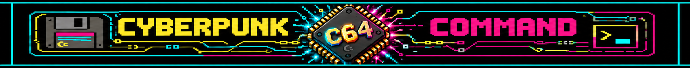

# Cyberpunk C64 Command

**A desktop companion for C64 Ultimate on Apple silicon Macs.**

Cyberpunk C64 Command brings disk images, files on the Ultimate, C64 controls,
media, case lighting and a local SID collection into one application. It grew
out of everyday use at a desk with a C64 close by. The machine and the people
who still make things for it are the reason this project exists.

The first public release is **planned for 27 September 2026**. The date may
change while the final build is checked.

## What it does

- **Disk Workbench:** open and inspect D64, D71 and D81 images; preview files,
  manage supported image contents and start programs on the C64.
- **File Manager:** browse, upload and download files on the Ultimate through
  FTP built into the Mac app. A separate bridge or Terminal window is not
  required.
- **C64 Remote Control:** control the C64 and its drives through the Ultimate.
- **Media and Light Studio:** start supported media and control compatible
  lighting.
- **SID Collection:** index a local High Voltage SID Collection, find tracks
  and play them on the Ultimate.

The local Disk Workbench can be used without an Ultimate. Hardware features
need a reachable C64 Ultimate or Ultimate 64 on the same network. The
corresponding REST and FTP services must be enabled for the features you use.

## Download and instructions

The Mac app will be available under **Releases** when the first public build
is ready. It is intended for Apple silicon Macs. The current build is not
signed or notarized with an Apple Developer ID; first launch may therefore
require macOS's **Open** confirmation.

- [Deutsche Bedienungsanleitung](docs/Anleitung-DE.pdf)
- [English user manual](docs/Manual-EN.pdf)
- [Connection and counter information](docs/NETWORK.md)
- [Getting help or reporting a problem](SUPPORT.md)

## Project and credits

This repository provides project information, manuals and release downloads.
The application source code is not published here.

Cyberpunk C64 Command is an independent fan project by **Breadbin Runner**.
It is not affiliated with Commodore, Ultimate or the High Voltage SID
Collection. Thanks to the hardware makers, the HVSC maintainers and the C64
scene for continuing to give this machine new things to do. Third-party
notices accompany the app download.

---

**Deutsch:** Cyberpunk C64 Command ist eine Mac-App für C64 Ultimate und
Ultimate 64. Disk-Werkbank, Dateimanager, Fernsteuerung, Medien, Licht und
SID-Sammlung sind in einer Oberfläche vereint. Die erste öffentliche
Veröffentlichung ist für den **27. September 2026** geplant. Die App läuft auf
Apple-Silicon-Macs; der Quellcode der App wird hier nicht veröffentlicht.
